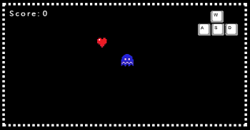

### Demo:Snake Game

[Link](https://spiraleyeld.github.io/Snake_Game/demo.html)

### Tip:Change direction

1.Snake's direction: right(screen update 1) →down(screen update 2) →right(screen update 3)

2.每移動一次，蛇身陣列unshift一個座標，pop一個座標，就能有蛇在移動的效果

前言:

由於一時興起，想說動手從無到有生出一個小遊戲，於是乎，動手開始寫貪食蛇，從邏輯的研究，到各種語法寫法比較，最後選擇JavaScript，主要是因為可以鑲在網頁上，如果可以搭配手機觸控操作，或許能讓更多人玩到，但本例只有到網頁遊戲完工，且尚有幾個更細的bug要處理，但大體上，是可以運作的。
邏輯說明:

遊戲主要是圍繞在蛇身上，我們的目的，是希望蛇能夠做到以下幾件事情。
1.移動 - 上下左右
2.吃愛心 - 吃完變長
3.遊戲結束-撞到自己身體
程式說明:

0.前置變數宣告
var canvas = document.getElementById('canvas');
var context = canvas.getContext('2d');

//載入人物圖片
var ghost = new Image() ; var heart = new Image();
var guide = new Image(); var gg = new Image();

// ghost 小精靈(蛇) heart 愛心(食物) guide 操作圖 gg 遊戲結束圖
ghost.src = "images/ghost.png" ; heart.src = "images/heart.png";      
guide.src = "images/awsd.png"; gg.src = "images/gg.png";

var score = 0; //給予分數初値，以及顯示字體的相關參數waw
var count = 0; // 給予執行主程式的初値

context.font="15px Courier New";
context.fillStyle="white";                

snakeCor = [{x:190,y:80}]; // 小精靈的座標
heartCorX = 150, heartCorY =50; // 愛心的座標
tipX = 320, tipY =8; // 上下左右提示的座標                

moveY=0; //y座標移動的距離初値
moveX=0; //x座標移動的距離初値
movDis=29; // x,y 座標移動的每次移動的距離
var limitX =15; var limitY =15; //此段是要控制小精靈距離愛心多遠才算吃掉
1.1移動
運作機制:
遊戲主要是透過Canvas畫布渲染，控制每固定毫秒出現的圖片，來達到視覺欺騙。
特別說明:

由於畫布的機制是每120毫秒會更新一次，所以我們得先搞懂蛇身變換時，陣列的配置
，假設有一條蛇，蛇頭是{x:9,y:10}，蛇身是{x:10,y:10}，假設今天蛇的長度不變，但
改變蛇的方向向下，則蛇頭會是新的座標位置，原來蛇尾的座標會消失，新的蛇尾是原
本蛇頭的座標，所以可以得知，每次改變方向的時候，蛇陣列0的位置要unshift(新增)
一個新座標，但因為只是改變方向，不是吃東西變長，所以為了維持原始長度，尾巴
要pop(陣列尾巴移除)一個蛇尾座標，如此，就可以達到蛇在移動的效果。
1.2.遊戲結束
運作機制:
同吃愛心，去計算蛇頭距離蛇身中任一單位近距離，則宣告遊戲結束。
function draw() {                             
    switch(count) 
    {        
        case 0:
        // 說明：
        // 1.程式每run(每120毫秒)一次，一開始會先把上一次有更動過的圖層淸掉
        // 2.接著依序draw 各項要素
        // 3.因爲要素與要素之間有順序關係，越後面越上層，彼此不干擾。
        context.clearRect(0,0,400,200); // 第零層 clear picture
        context.fillText("Score : "+score,8,18); // 第一層 成績     
        context.drawImage(guide,0,0,70,45,tipX,tipY,70,45); // 第二層 指標

        for(var i =0;i<snakeCor.length; i++){ // 第三層 小精靈(畫出整條蛇)
            context.drawImage(ghost,0,0,29,26,snakeCor[i].x,snakeCor[i].y,29,26);
            // 如果蛇身只有頭則無視
            if(snakeCor.length==1){
                iThink='awei_is_cool';
            // 如果蛇身有頭也有身體(長度>1)則開始進行"砍尾補頭循環"
            }else if(i==snakeCor.length-1){
                ////////////////一直都在砍蛇尾的座標
                snakeCor.pop();
            }
        };

        context.drawImage(heart,0,0,25,25,heartCorX,heartCorY,25,25); // 第四層 愛心
        // 指定小精靈在正常情況下的位移，以及隨時搭配"心動時刻"                                        
        if(snakeCor[0].y>0 || snakeCor[0].y<176 && snakeCor[0].x>0 || snakeCor[0].x<378 ){
            snakeCor[0].y+=moveY;
            snakeCor[0].x+=moveX;
        // 判斷蛇身是否有重疊，，如果成立count+1，因為count=1 (switch case中不等於0)所以遊戲會停止執行。
            for(var i=1;i<snakeCor.length;i++){
                if(snakeCor[0].x==snakeCor[i].x && snakeCor[0].y == snakeCor[i].y){
                    count=0;
                    count+=1;
                    if(count>0){                        
                        context.drawImage(gg,0,0,150,60,125,75,150,60);
                    }
                }
            }
            ///////////////////一直都在補蛇頭的座標
            snakeCor.unshift({x:snakeCor[0].x,y:snakeCor[0].y});                
            heartChange();
        }
        // 匡住小精靈的移動範圍
        if(snakeCor[0].y<=0){                        
            snakeCor[0].y=175;                        
        }
        if(snakeCor[0].y>=176){                                
            snakeCor[0].y=0;                    
        }
        if(snakeCor[0].x<=0){
            snakeCor[0].x=376;                                    
        }
        if(snakeCor[0].x>=377){
            snakeCor[0].x=-25;                                        
        }                                
        break;
    }
}
2.方向改變-按鍵設置&移動距離參數設置
var blockUpper=true; var blockRight=true;
var blockDown=true; var blockLeft=true;
var keyPress;

function fowardChange(){
    keyPress = event.keyCode;
    switch (keyPress) {
        case 87: // keyboard: W
        break;
        case 68: // keyboard: D
        break;
        case 83: // keyboard: S
        break;
        case 65: // keyboard: A
        break;
        case 32: // keyboard: Space
        break;
    }
// 這邊有個小技巧，如果x座標已經設定移動距離moveY，y座標的移動距離moveX要設定爲0，
// 目的是要讓小精靈行進時，每次按鍵都維持在單一方向。
    if(keyPress==87 && blockUpper==true){
        moveY=-movDis;
        moveX=0;
        blockRight=true;
        blockDown=false;
        blockLeft=true;                    
    }
    if(keyPress==68 && blockRight==true){
        moveX=movDis;
        moveY=0;
        blockUpper=true;
        blockDown=true;
        blockLeft=false;                    
    }
    if(keyPress==83 && blockDown==true){
        moveY=movDis;
        moveX=0;
        blockUpper=false;
        blockRight=true;
        blockLeft=true;
    }
    if(keyPress==65 && blockLeft==true){
        moveX=-movDis;
        moveY=0;
        blockUpper=true;
        blockRight=false;
        blockDown=true;                    
    }
}
3.吃愛心
運作機制:
由於整體運作是控制所有圖片的出場順序，故吃愛心是以，當蛇跟愛心接近到一定近距離時，則愛心消失，蛇身變長。
function heartChange(){
    if(Math.abs(snakeCor[0].x-heartCorX)<limitX && Math.abs(snakeCor[0].y-heartCorY)<limitY){                    
        while(true){
            var countError =0;
            heartCorX=canvas.width*Math.random();
            heartCorY=canvas.height*Math.random();
            for(var i=0;i<snakeCor.length;i++){
                if(Math.abs(snakeCor[i].x-heartCorX)<12 && Math.abs(snakeCor[i].y-heartCorY)<12){
                    countError+=1;
                }
            }
            if(heartCorY>10 && heartCorY<170 && heartCorX>10 && heartCorX<350 && countError==0){
                break;
            }                
        }
        // 只要讓愛心位移（被吃）1次，分數就+1                    
        score+=1;
        ////// 如果分數+1，蛇頭的位置重複添加1次以原蛇頭的座標值為新座標，因為要增加長度
        snakeCor.unshift({x:snakeCor[0].x,y:snakeCor[0].y});
    }
}
4.JS 事件聆聽
window.addEventListener('load',setInterval(draw, 120),false); // 執行draw方法每120毫秒
window.addEventListener('load',heartChange,false); // 載入JS時讀入方法
window.addEventListener('keydown',fowardChange,false); //鍵盤觸碰時讀入方法

