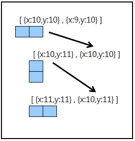

## Welcome to AWei's GitHub


### Snake Game


[Demo](https://spiraleyeld.github.io/Snake_Game/demo.html)

### Change the direction

1.蛇移動的方式 圖例依序為 右(畫面更新第一次)→下(第二次)→右(第三次)，
2.陣列頭加一個座標，陣列尾巴抽掉一個座標，能造成蛇移動的效果

```markdown

function heartChange(){
					
	if(Math.abs(r[0].x-x1)<t1 && Math.abs(r[0].y-y1)<t2){
						
		while(true){
			var countError =0;
			x1=canvas.width*Math.random();
			y1=canvas.height*Math.random();
			for(var i=0;i<r.length;i++){
				if(Math.abs(r[i].x-x1)<12 && Math.abs(r[i].y-y1)<12){
					countError+=1;
				}
			}
							
            	    if(y1>10 && y1<170 && x1>10 && x1<350 && countError==0){
			break;
			}
								
		}
                        
		// 愛心 更改位置一次，則分數加一，蛇身陣列加一(由陣列0的位置加入)		
		score+=1;
		r.unshift({x:r[0].x,y:r[0].y});
	}
}  

```


